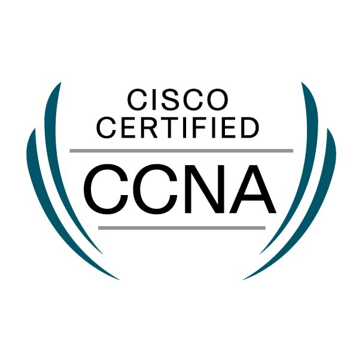

  

###

  

###

<h1 align="center">Hi there, I'm Vincent 👋</h1>

###

  

###

<h2 align="left">👨🏼‍🎓 About Me</h2>

###

I'm Vincent Xavery Harlim, an AI enthusiast and a lifelong learner pursuing Bachelor of Computer Science with ongoing 3.83 GPA at Swinburne University of Technology. I also love to go to the gym 🏋🏼, ride my motorcycle 🏍️, and read books 📘.  Currently learning about RAG, Docker, MLOps, and Cloud for AI  Throughout my 4 years of learning, I found interest in diverse fields in technology, those are: - Computer networking and security - Software architecture - Mobile development - Internet of Things

###

<h2 align="left">🛠 Language and tools</h2>

###

  
  
  
  
  
  
  
  
  
  
  
  
  
  
  
  
  
  
  

###

<h2 align="left">📚 Certifications</h2>
  
  

###
